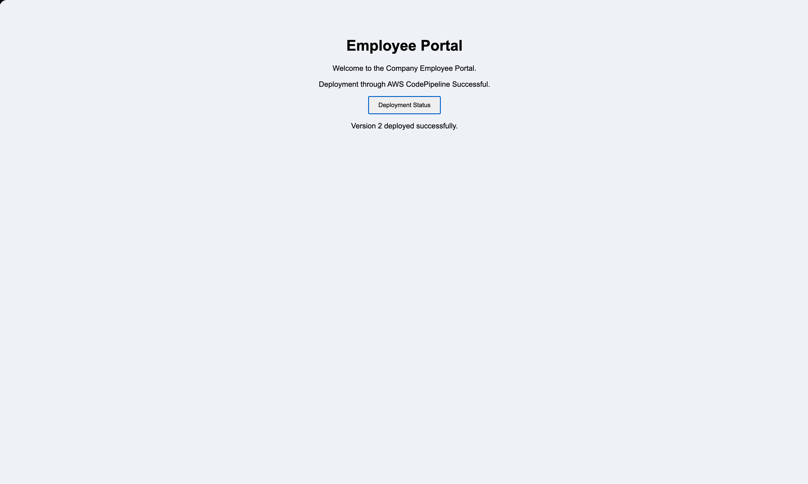
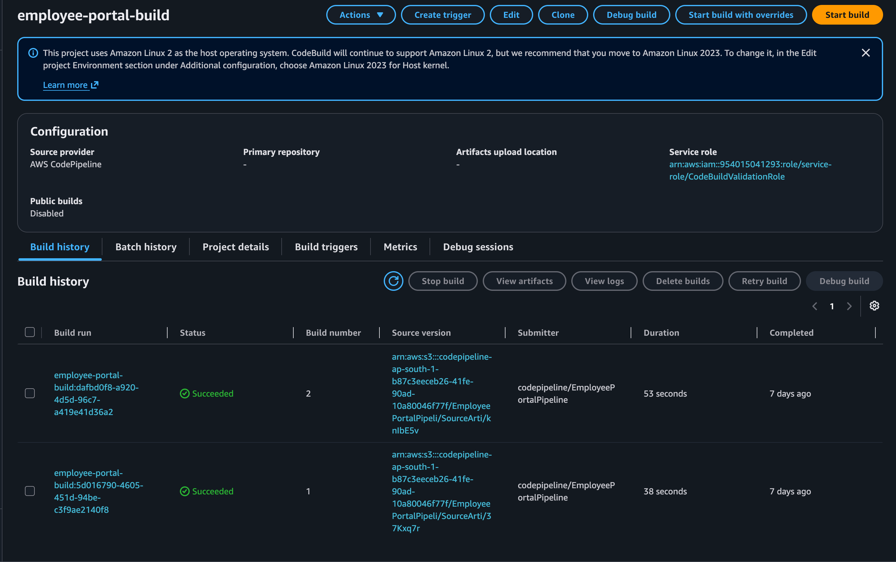
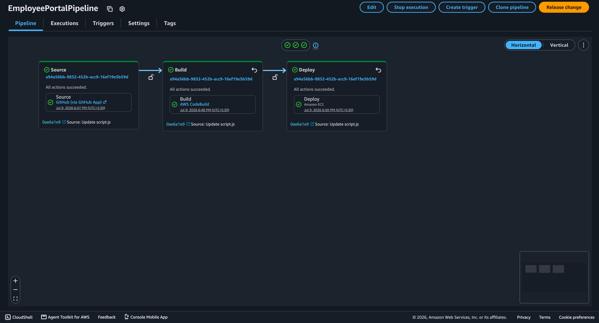

# 🏢 Company Employee Portal

## 📝 Project Overview
The Company Employee Portal is a simple web-based interface deployed using an automated CI/CD pipeline on AWS. It serves as a demonstration of automatic web hosting deployment triggered by updates in a GitHub repository.

## ✨ Key Features
- **CI/CD Automation**: Automated delivery pipeline triggered by repository changes.
- **HTML Validation**: Integrated syntax validation using HTMLHint.
- **Nginx Web Server**: Hosted on an EC2 instance powered by Nginx.

## 📐 System Architecture
The application frontend is hosted on **Amazon EC2** running an Nginx web server. The deployment pipeline is automated using **AWS CodePipeline**, which pulls code changes from **GitHub**, triggers **AWS CodeBuild** to validate HTML files via HTMLHint, and deploys the validated artifact onto the EC2 instance, followed by reloading Nginx with `postScript.sh`.

## 📸 Screenshots

### 🖥️ Frontend

#### 🏠 Frontend Home


### ☁️ AWS Infrastructure & CI/CD

#### ⚙️ CodeBuild Execution


#### 🔄 CodePipeline Execution


## ⚙️ AWS Services Used
- **Amazon EC2**: Hosts the Nginx web server and displays the static frontend portal.
- **AWS CodePipeline**: Orchestrates the automated pipeline from GitHub release to deployment.
- **AWS CodeBuild**: Executes HTML syntax validation using `htmlhint` in Node.js during the build phase.
- **AWS IAM**: Manages secure service execution roles for CodePipeline and CodeBuild.

## 🔄 Project Workflow
1. **Code Commit**: A developer commits code changes to the GitHub repository.
2. **Source Stage**: AWS CodePipeline detects the commit and retrieves the latest source code.
3. **Build & Validation Stage**: CodePipeline routes the source to AWS CodeBuild, which runs `htmlhint` on all HTML files as defined in `buildspec.yml`.
4. **Deployment Stage**: The validated files are deployed to the target EC2 web directory, where `postScript.sh` reloads the Nginx service.

## 🛠️ Technology Stack
- **Frontend**: HTML5, CSS3 (Vanilla), JavaScript.
- **Web Server**: Nginx.
- **Build Tools**: Node.js 18, HTMLHint.
- **Cloud Services**: Amazon EC2, AWS CodePipeline, AWS CodeBuild, AWS IAM.

## 📂 Repository Structure
```
.
├── buildspec.yml
├── index.html
├── postScript.sh
├── project_images/
│   ├── CodeBuild.png
│   ├── CodePipeline.png
│   └── frontend-home.png
├── script.js
└── style.css
```

## 🚀 Deployment
The frontend is hosted on **Amazon EC2** running Nginx. Automatic continuous deployment is handled by CodePipeline.

## 🤖 CI/CD Pipeline
The application utilizes **AWS CodePipeline** and **AWS CodeBuild** triggered by GitHub commits, executing HTMLHint validation before deploying changes.

## 🎓 Learning Outcomes
- Configured source-control-triggered continuous deployment using AWS CodePipeline.
- Set up AWS CodeBuild environment to perform static linting/validation of HTML code.
- Wrote Shell scripting to automate service reloading (Nginx) post-deployment.
- Managed and verified service integration policies with IAM permissions.